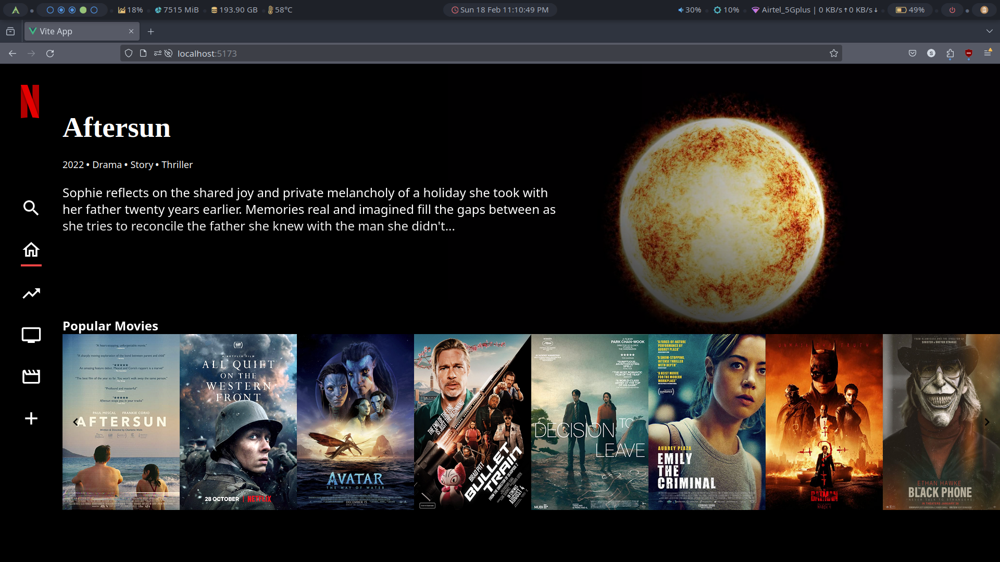
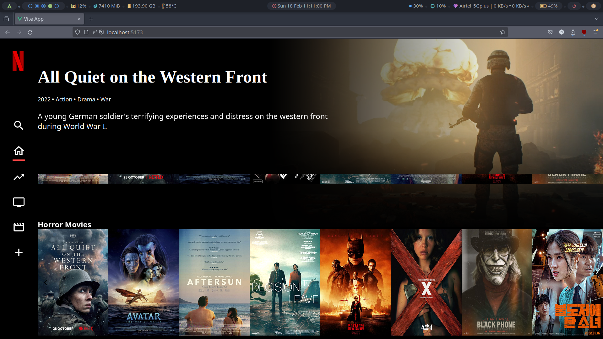
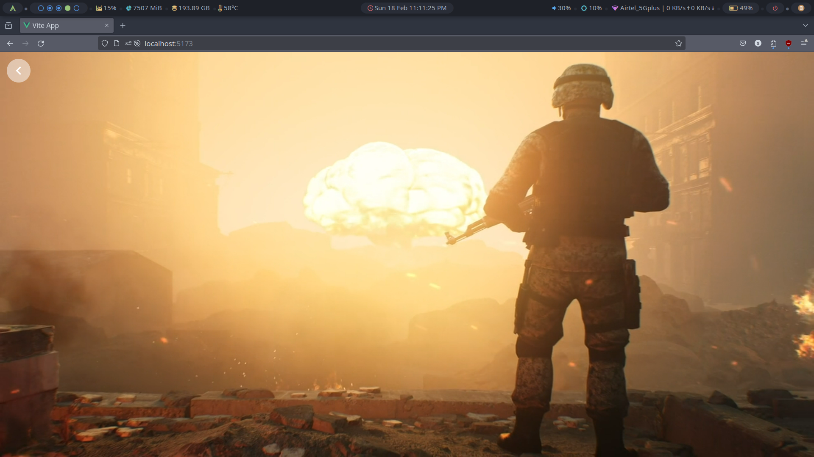

# Netflix Television Clone

A Netflix television clone built with Vue.js and Pinia, using TypeScript.

## Screenshots





## Description

This project is a clone of the Netflix television interface, showcasing the use of Vue.js with Pinia for state management. It provides a simple and responsive user interface to browse and watch television content.

## Features

- Vue.js with TypeScript
- State management using Pinia

## Getting Started

### Prerequisites

- Node.js (version 21.6.2)
- npm (version 10.3.0)

### Installation and Usage

1. Clone the repository:

   ```bash
   git clone https://github.com/your-username/netflix-television-clone.git
   ```

2. Navigate to the project directory:

   ```
   cd netflix-clone
   ```

3. Install dependencies:

   ```
   npm install
   ```

4. Start the development server:

   ```
   npm run dev
   ```
